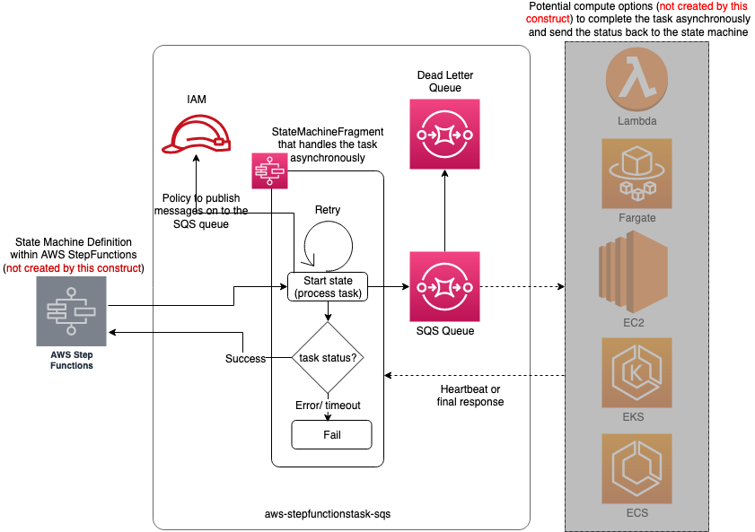

# aws-stepfunctionstask-sqs module

<!--BEGIN STABILITY BANNER-->

---


> All classes are under active development and subject to non-backward compatible changes or removal in any
> future version. These are not subject to the [Semantic Versioning](https://semver.org/) model.
> This means that while you may use them, you may need to update your source code when upgrading to a newer version of this package.

---

<!--END STABILITY BANNER-->

| **Reference Documentation**: | <span style="font-weight: normal">https://docs.aws.amazon.com/solutions/latest/constructs/</span> |
| :--------------------------- | :------------------------------------------------------------------------------------------------ |

<div style="height:8px"></div>

| **Language**                                                                                   | **Package**                                                   |
| :--------------------------------------------------------------------------------------------- | ------------------------------------------------------------- |
|  Python             | `aws_solutions_constructs.aws_stepfunctionstask_sqs`          |
|  Typescript | `@aws-solutions-constructs/aws-stepfunctionstask-sqs`         |
|  Java                   | `software.amazon.awsconstructs.services.stepfunctionstasksqs` |

This AWS Solutions Construct implements an AWS Step Functions state machine task that is backed by an Amazon SQS queue. This queue can be integrated with any
compute option (not implemented within this construct); AWS Lambda, Amazon Fargate, Amazon EC2, Amazon EKS or Amazon ECS.

Here is a minimal deployable pattern definition in Typesciprt:

```typescript
import { StepfunctionstaskSqs } from "@aws-solutions-constructs/aws-stepfunctionstask-sqs";
import * as sfn from "@aws-cdk/aws-stepfunctions";

const asyncTask = new StepfunctionstaskSqs(this, "SqsAsyncTask", {});
asyncTask.next(new sfn.Succeed(this, "Success"));

const workflowChain = sfn.Chain.start(asyncTask);
new StateMachine(this, "WorkflowEngine", {
    definition: workflowChain,
});
```

## Initializer

```text
new StepfunctionstaskSqs(scope: Construct, id: string, props: StepfunctionstaskToSqsProps);
```

_Parameters_

-   scope [`Construct`](https://docs.aws.amazon.com/cdk/api/latest/docs/@aws-cdk_core.Construct.html)
-   id `string`
-   props [`StepfunctionstaskToSqsProps`](#pattern-construct-props)

## Pattern Construct Props

| **Name**               | **Type**                                                                                                                           | **Description**                                                                                                                    |
| :--------------------- | :--------------------------------------------------------------------------------------------------------------------------------- | ---------------------------------------------------------------------------------------------------------------------------------- |
| existingQueueObj?      | [`sqs.Queue`](https://docs.aws.amazon.com/cdk/api/latest/docs/@aws-cdk_aws-sqs.Queue.html)                                         | An optional, existing SQS queue to be used instead of the default queue. Providing both this and `queueProps` will cause an error. |
| queueProps?            | [`sqs.QueueProps`](https://docs.aws.amazon.com/cdk/api/latest/docs/@aws-cdk_aws-sqs.QueueProps.html)                               | Optional user-provided props to override the default props for the SQS queue.                                                      |
| deadLetterQueueProps?  | [`sqs.QueueProps`](https://docs.aws.amazon.com/cdk/api/latest/docs/@aws-cdk_aws-sqs.QueueProps.html)                               | Optional user-provided props to override the default props for the dead letter SQS queue.                                          |
| deployDeadLetterQueue? | `boolean`                                                                                                                          | Whether to create a secondary queue to be used as a dead letter queue. Defaults to true.                                           |
| maxReceiveCount?       | `number`                                                                                                                           | The number of times a message can be unsuccessfully dequeued before being moved to the dead letter queue. Defaults to 15.          |
| sqsSendMessageProps?   | [`SqsSendMessageProps`](https://docs.aws.amazon.com/cdk/api/latest/docs/@aws-cdk_aws-stepfunctions-tasks.SqsSendMessageProps.html) | Optional user provided properties to create an SQS based stepfunctions task                                                        |

## Pattern Properties

| **Name**         | **Type**                                                                                            | **Description**                                                                                                                                                      |
| :--------------- | :-------------------------------------------------------------------------------------------------- | -------------------------------------------------------------------------------------------------------------------------------------------------------------------- |
| sqsQueue         | [`sqs.Queue`](https://docs.aws.amazon.com/cdk/api/latest/docs/@aws-cdk_aws-sqs.Queue.html)          | Returns an instance of the SQS queue created by the pattern.                                                                                                         |
| deadLetterQueue? | [`sqs.Queue`](https://docs.aws.amazon.com/cdk/api/latest/docs/@aws-cdk_aws-sqs.Queue.html)          | Returns an instance of the dead-letter SQS queue created by the pattern.                                                                                             |
| startState       | [`State`](https://docs.aws.amazon.com/cdk/api/latest/docs/@aws-cdk_aws-stepfunctions.State.html)    | Returns the start state of the [`StateMachineFragment`](https://docs.aws.amazon.com/cdk/api/latest/docs/@aws-cdk_aws-stepfunctions.StateMachineFragment.html)        |
| endStates        | [`States[]`](https://docs.aws.amazon.com/cdk/api/latest/docs/@aws-cdk_aws-stepfunctions.State.html) | Returns an array of end states of the [`StateMachineFragment`](https://docs.aws.amazon.com/cdk/api/latest/docs/@aws-cdk_aws-stepfunctions.StateMachineFragment.html) |

## Default settings

Out of the box implementation of the Construct without any override will set the following defaults:

### Amazon SQS Queue

-   Deploy SQS dead-letter queue for the source SQS Queue
-   Enable server-side encryption for source SQS Queue using AWS Managed KMS Key
-   Enforce encryption of data in transit

### AWS StepFunctions Task

-   Configure limited privilege access IAM role for the StepFunctions Task function so that it can publish messages on the SQS queue
-   Create a [`Fail`](https://docs.aws.amazon.com/cdk/api/latest/docs/@aws-cdk_aws-stepfunctions.Fail.html) state it transition to if the task fails
-   Add retry logic to the StepFunctions task, with a back-off-rate of 2, maximum number of attempts as 6 and interval duration of 3 seconds
-   Create a message body for SQS queue with `input` starting at the root of the JSON using `$` and `taskToken`
-   Define output path for the response from the stepfunctions task as `$`
-   Define a `heartbeat` to be recieved by the stepfuntions for the [`State`](https://docs.aws.amazon.com/cdk/api/latest/docs/@aws-cdk_aws-stepfunctions.State.html) to be considered 'active' atleast once in every 60 mins.
-   Define a `timeout` of 720 mins (12 hours) after which the state will transition to the [`Fail`](https://docs.aws.amazon.com/cdk/api/latest/docs/@aws-cdk_aws-stepfunctions.Fail.html) state in case a success or failure is not received

## Architecture



---

&copy; Copyright 2021 Amazon.com, Inc. or its affiliates. All Rights Reserved.
