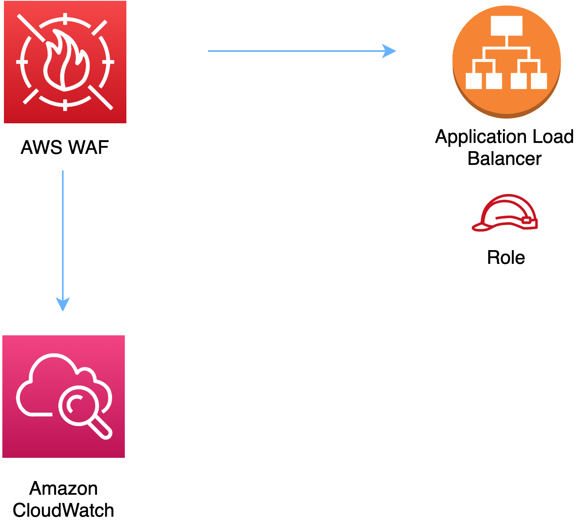

//!!NODE_ROOT <section>
//== aws-wafwebacl-alb module

[.topic]
= aws-wafwebacl-alb
:info_doctype: section
:info_title: aws-wafwebacl-alb

image::https://img.shields.io/badge/stability-Experimental-important.svg?style=for-the-badge[Stability:Experimental]

____
All classes are under active development and subject to non-backward
compatible changes or removal in any future version. These are not
subject to the https://semver.org/[Semantic Versioning] model. This
means that while you may use them, you may need to update your source
code when upgrading to a newer version of this package.
____

[width="100%",cols="<50%,<50%",options="header",]
|===
|*Reference Documentation*:
|https://docs.aws.amazon.com/solutions/latest/constructs/
|===

[width="100%",cols="<46%,54%",options="header",]
|===
|*Language* |*Package*
|image:https://docs.aws.amazon.com/cdk/api/latest/img/python32.png[Python
Logo] Python
|`aws_solutions_constructs.aws_wafwebacl_alb`

|image:https://docs.aws.amazon.com/cdk/api/latest/img/typescript32.png[Typescript
Logo] Typescript |`@aws-solutions-constructs/aws-wafwebacl-alb`

|image:https://docs.aws.amazon.com/cdk/api/latest/img/java32.png[Java
Logo] Java |`software.amazon.awsconstructs.services.wafwebaclalb`
|===

== Overview

This AWS Solutions Construct implements an AWS WAF web ACL connected to
an Application Load Balancer.

Here is a minimal deployable pattern definition:

====
[role="tablist"]
Typescript::
+
[source,typescript]
----
import { Construct } from 'constructs';
import { Stack, StackProps } from 'aws-cdk-lib';
import { WafwebaclToAlbProps, WafwebaclToAlb } from "@aws-solutions-constructs/aws-wafwebacl-alb";

// Use an existing ALB, such as one created by Route53toAlb or AlbToLambda
const existingLoadBalancer = previouslyCreatedLoadBalancer

// Note - all alb constructs turn on ELB logging by default, so require that an environment including account
// and region be provided when creating the stack
//
// new MyStack(app, 'id', {env: {account: '123456789012', region: 'us-east-1' }});
//
// This construct can only be attached to a configured Application Load Balancer.
new WafwebaclToAlb(this, 'test-wafwebacl-alb', {
    existingLoadBalancerObj: existingLoadBalancer
});
----

Python::
+
[source,python]
----
from aws_solutions_constructs.aws_route53_alb import Route53ToAlb
from aws_solutions_constructs.aws_wafwebacl_alb import WafwebaclToAlbProps, WafwebaclToAlb
from aws_cdk import (
    aws_route53 as route53,
    Stack
)
from constructs import Construct

# Use an existing ALB, such as one created by Route53toAlb or AlbToLambda
existingLoadBalancer = previouslyCreatedLoadBalancer

# Note - all alb constructs turn on ELB logging by default, so require that an environment including account
# and region be provided when creating the stack
#
# MyStack(app, 'id', env=cdk.Environment(account='123456789012', region='us-east-1'))
#
# This construct can only be attached to a configured Application Load Balancer.
WafwebaclToAlb(self, 'test_wafwebacl_alb',
                existing_load_balancer_obj=existingLoadBalancer
                )
----

Java::
+
[source,java]
----
import software.constructs.Construct;

import software.amazon.awscdk.Stack;
import software.amazon.awscdk.StackProps;
import software.amazon.awscdk.services.route53.*;
import software.amazon.awsconstructs.services.wafwebaclalb.*;

// Use an existing ALB, such as one created by Route53toAlb or AlbToLambda
final existingLoadBalancer = previouslyCreatedLoadBalancer

// Note - all alb constructs turn on ELB logging by default, so require that an environment including account
// and region be provided when creating the stack
//
// new MyStack(app, "id", StackProps.builder()
//         .env(Environment.builder()
//                 .account("123456789012")
//                 .region("us-east-1")
//                 .build());
//
// This construct can only be attached to a configured Application Load Balancer.
new WafwebaclToAlb(this, "test-wafwebacl-alb", new WafwebaclToAlbProps.Builder()
        .existingLoadBalancerObj(existingLoadBalancer)
        .build());
----
====

== Pattern Construct Props

[width="100%",cols="<30%,<35%,35%",options="header",]
|===
|*Name* |*Type* |*Description*
|existingLoadBalancerObj
|https://docs.aws.amazon.com/cdk/api/v2/docs/aws-cdk-lib.aws_elasticloadbalancingv2.ApplicationLoadBalancer.html[`elbv2.ApplicationLoadBalancer`]
|The existing Application Load Balancer Object that will be protected
with the WAF web ACL. _Note that a WAF web ACL can only be added to a
configured Application Load Balancer, so this construct only accepts an
existing ApplicationLoadBalancer and does not accept
applicationLoadBalancerProps._

|existingWebaclObj?
|https://docs.aws.amazon.com/cdk/api/v2/docs/aws-cdk-lib.aws_waf.CfnWebACL.html[`waf.CfnWebACL`]
|Existing instance of a WAF web ACL, an error will occur if this and
props is set.

|webaclProps?
|https://docs.aws.amazon.com/cdk/api/v2/docs/aws-cdk-lib.aws_waf.CfnWebACLProps.html[`waf.CfnWebACLProps`]
|Optional user-provided props to override the default props for the AWS
WAF web ACL. To use a different collection of managed rule sets, specify
a new rules property. Use our
link:../core/lib/waf-defaults.ts[`wrapManagedRuleSet(managedGroupName: string, vendorName: string, priority: number)`]
function from core to create an array entry from each desired managed
rule set.
|===

== Pattern Properties

[width="100%",cols="<30%,<35%,35%",options="header",]
|===
|*Name* |*Type* |*Description*
|webacl
|https://docs.aws.amazon.com/cdk/api/v2/docs/aws-cdk-lib.aws_waf.CfnWebACL.html[`waf.CfnWebACL`]
|Returns an instance of the waf.CfnWebACL created by the construct.

|loadBalancer
|https://docs.aws.amazon.com/cdk/api/v2/docs/aws-cdk-lib.aws_elasticloadbalancingv2.ApplicationLoadBalancer.html[`elbv2.ApplicationLoadBalancer`]
|Returns an instance of the Application Load Balancer Object created by
the pattern.
|===

== Default settings

Out of the box implementation of the Construct without any override will
set the following defaults:

==== AWS WAF

* Deploy a WAF web ACL with 7
https://docs.aws.amazon.com/waf/latest/developerguide/aws-managed-rule-groups-list.html[AWS
managed rule groups].
** AWSManagedRulesBotControlRuleSet
** AWSManagedRulesKnownBadInputsRuleSet
** AWSManagedRulesCommonRuleSet
** AWSManagedRulesAnonymousIpList
** AWSManagedRulesAmazonIpReputationList
** AWSManagedRulesAdminProtectionRuleSet
** AWSManagedRulesSQLiRuleSet
+
_Note that the default rules can be replaced by specifying the rules
property of CfnWebACLProps_
* Send metrics to Amazon CloudWatch

==== Application Load Balancer

* User provided Application Load Balancer object is used as-is

== Architecture

\\ github block

'''''

© Copyright Amazon.com, Inc. or its affiliates. All Rights Reserved.
