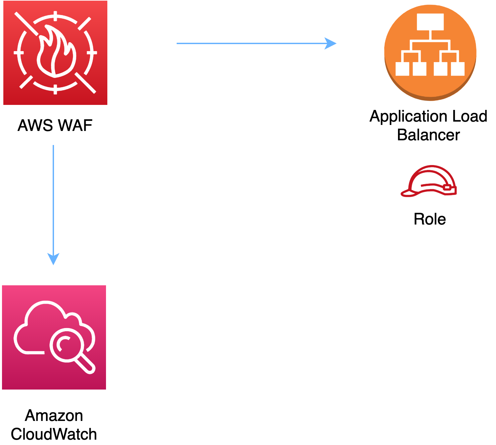

# aws-wafwebacl-alb module
<!--BEGIN STABILITY BANNER-->

---


> All classes are under active development and subject to non-backward compatible changes or removal in any
> future version. These are not subject to the [Semantic Versioning](https://semver.org/) model.
> This means that while you may use them, you may need to update your source code when upgrading to a newer version of this package.

---
<!--END STABILITY BANNER-->

| **Reference Documentation**:| <span style="font-weight: normal">https://docs.aws.amazon.com/solutions/latest/constructs/</span>|
|:-------------|:-------------|
<div style="height:8px"></div>


| **Language**     | **Package**        |
|:-------------|-----------------|
| Python|`aws_solutions_constructs.aws_wafwebacl_alb`|
| Typescript|`@aws-solutions-constructs/aws-wafwebacl-alb`|
| Java|`software.amazon.awsconstructs.services.wafwebaclalb`|

## Overview
This AWS Solutions Construct implements an AWS WAF web ACL connected to an Application Load Balancer.

Here is a minimal deployable pattern definition:

Typescript
``` typescript
import { Route53ToAlb } from '@aws-solutions-constructs/aws-route53-alb';
import { WafwebaclToAlbProps, WafwebaclToAlb } from "@aws-solutions-constructs/aws-wafwebacl-alb";

// Use an existing ALB, such as one created by Route53toAlb or AlbToLambda
const existingLoadBalancer = previouslyCreatedLoadBalancer

// This construct can only be attached to a configured Application Load Balancer.
// Required: Must specify environment (account, region)
new WafwebaclToAlb(this, 'test-wafwebacl-alb', {
    existingLoadBalancerObj: previouslyCreatedLoadBalancer
});
```

Python
```python
from aws_solutions_constructs.aws_route53_alb import Route53ToAlb
from aws_solutions_constructs.aws_wafwebacl_alb import WafwebaclToAlbProps, WafwebaclToAlb
from aws_cdk import (
    aws_route53 as route53,
    Stack
)
from constructs import Construct

# Use an existing ALB, such as one created by Route53toAlb or AlbToLambda
existingLoadBalancer = previouslyCreatedLoadBalancer

# This construct can only be attached to a configured Application Load Balancer.
# Required: Must specify environment (account, region)
WafwebaclToAlb(self, 'test_wafwebacl_alb',
                existing_load_balancer_obj=existingLoadBalancer
                )
```

Java
``` java
import software.constructs.Construct;

import software.amazon.awscdk.Stack;
import software.amazon.awscdk.StackProps;
import software.amazon.awscdk.services.route53.*;
import software.amazon.awsconstructs.services.route53alb.*;
import software.amazon.awsconstructs.services.wafwebaclalb.*;

// Use an existing ALB, such as one created by Route53toAlb or AlbToLambda
final existingLoadBalancer = previouslyCreatedLoadBalancer

// This construct can only be attached to a configured Application Load Balancer.
// Required: Must specify environment (account, region)
new WafwebaclToAlb(this, "test-wafwebacl-alb", new WafwebaclToAlbProps.Builder()
        .existingLoadBalancerObj(previouslyCreatedLoadBalancer)
        .build());
```
## Pattern Construct Props

| **Name**     | **Type**        | **Description** |
|:-------------|:----------------|-----------------|
|existingLoadBalancerObj|[`elbv2.ApplicationLoadBalancer`](https://docs.aws.amazon.com/cdk/api/latest/docs/@aws-cdk_aws-elasticloadbalancingv2.ApplicationLoadBalancer.html)|The existing Application Load Balancer Object that will be protected with the WAF web ACL. *Note that a WAF web ACL can only be added to a configured Application Load Balancer, so this construct only accepts an existing ApplicationLoadBalancer and does not accept applicationLoadBalancerProps.*|
|existingWebaclObj?|[`waf.CfnWebACL`](https://docs.aws.amazon.com/cdk/api/latest/docs/@aws-cdk_aws-waf.CfnWebACL.html)|Existing instance of a WAF web ACL, an error will occur if this and props is set.|
|webaclProps?|[`waf.CfnWebACLProps`](https://docs.aws.amazon.com/cdk/api/latest/docs/@aws-cdk_aws-waf.CfnWebACLProps.html)|Optional user-provided props to override the default props for the AWS WAF web ACL. To use a different collection of managed rule sets, specify a new rules property. Use our [`wrapManagedRuleSet(managedGroupName: string, vendorName: string, priority: number)`](../core/lib/waf-defaults.ts) function from core to create an array entry from each desired managed rule set.|

## Pattern Properties

| **Name**     | **Type**        | **Description** |
|:-------------|:----------------|-----------------|
|webacl|[`waf.CfnWebACL`](https://docs.aws.amazon.com/cdk/api/latest/docs/@aws-cdk_aws-waf.CfnWebACL.html)|Returns an instance of the waf.CfnWebACL created by the construct.|
|loadBalancer|[`elbv2.ApplicationLoadBalancer`](https://docs.aws.amazon.com/cdk/api/latest/docs/@aws-cdk_aws-elasticloadbalancingv2.ApplicationLoadBalancer.html)|Returns an instance of the Application Load Balancer Object created by the pattern. |

## Default settings

Out of the box implementation of the Construct without any override will set the following defaults:

### AWS WAF
* Deploy a WAF web ACL with 7 [AWS managed rule groups](https://docs.aws.amazon.com/waf/latest/developerguide/aws-managed-rule-groups-list.html).
    * AWSManagedRulesBotControlRuleSet
    * AWSManagedRulesKnownBadInputsRuleSet
    * AWSManagedRulesCommonRuleSet
    * AWSManagedRulesAnonymousIpList
    * AWSManagedRulesAmazonIpReputationList
    * AWSManagedRulesAdminProtectionRuleSet
    * AWSManagedRulesSQLiRuleSet

    *Note that the default rules can be replaced by specifying the rules property of CfnWebACLProps*
* Send metrics to Amazon CloudWatch

### Application Load Balancer
* User provided Application Load Balancer object is used as-is

## Architecture


***
&copy; Copyright 2021 Amazon.com, Inc. or its affiliates. All Rights Reserved.
