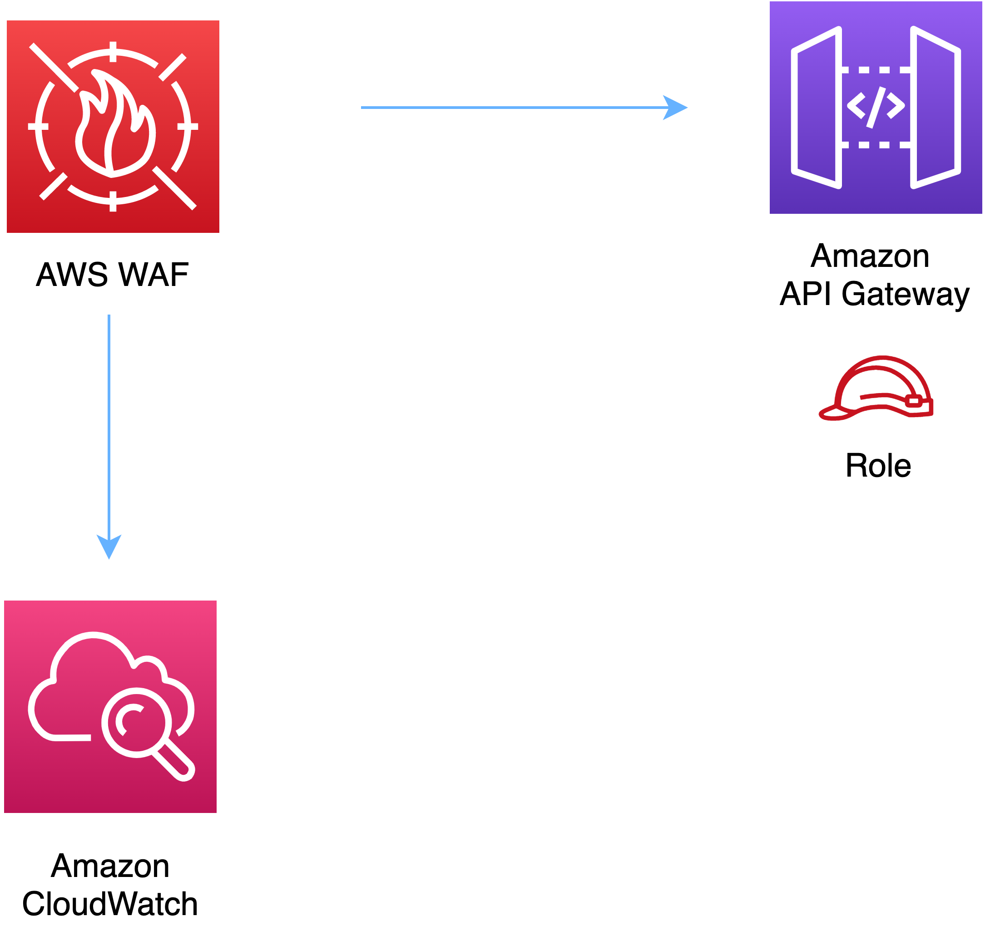

//!!NODE_ROOT <section>
//== aws-wafwebacl-apigateway module

[.topic]
= aws-wafwebacl-apigateway
:info_doctype: section
:info_title: aws-wafwebacl-apigateway

image::https://img.shields.io/badge/stability-Experimental-important.svg?style=for-the-badge[Stability:Experimental]

____
All classes are under active development and subject to non-backward
compatible changes or removal in any future version. These are not
subject to the https://semver.org/[Semantic Versioning] model. This
means that while you may use them, you may need to update your source
code when upgrading to a newer version of this package.
____

[width="100%",cols="<50%,<50%",options="header",]
|===
|*Reference Documentation*:
|https://docs.aws.amazon.com/solutions/latest/constructs/
|===

[width="100%",cols="<46%,54%",options="header",]
|===
|*Language* |*Package*
|image:https://docs.aws.amazon.com/cdk/api/latest/img/python32.png[Python
Logo] Python
|`aws_solutions_constructs.aws_wafwebacl_apigateway`

|image:https://docs.aws.amazon.com/cdk/api/latest/img/typescript32.png[Typescript
Logo] Typescript |`@aws-solutions-constructs/aws-wafwebacl-apigateway`

|image:https://docs.aws.amazon.com/cdk/api/latest/img/java32.png[Java
Logo] Java |`software.amazon.awsconstructs.services.wafwebaclapigateway`
|===

== Overview

This AWS Solutions Construct implements an AWS WAF web ACL connected to
Amazon API Gateway REST API.

Here is a minimal deployable pattern definition:

====
[role="tablist"]
Typescript::
+
[source,typescript]
----
import { Construct } from 'constructs';
import { Stack, StackProps } from 'aws-cdk-lib';
import * as lambda from "aws-cdk-lib/aws-lambda";
import { ApiGatewayToLambda } from '@aws-solutions-constructs/aws-apigateway-lambda';
import { WafwebaclToApiGatewayProps, WafwebaclToApiGateway } from "@aws-solutions-constructs/aws-wafwebacl-apigateway";

const apiGatewayToLambda = new ApiGatewayToLambda(this, 'ApiGatewayToLambdaPattern', {
  lambdaFunctionProps: {
    runtime: lambda.Runtime.NODEJS_20_X,
    handler: 'index.handler',
    code: lambda.Code.fromAsset(`lambda`)
  }
});

// This construct can only be attached to a configured API Gateway.
new WafwebaclToApiGateway(this, 'test-wafwebacl-apigateway', {
  existingApiGatewayInterface: apiGatewayToLambda.apiGateway
});
----

Python::
+
[source,python]
----
from aws_solutions_constructs.aws_apigateway_lambda import ApiGatewayToLambda
from aws_solutions_constructs.aws_wafwebacl_apigateway import WafwebaclToApiGatewayProps, WafwebaclToApiGateway
from aws_cdk import (
    aws_apigateway as api,
    aws_lambda as _lambda,
    Stack
)
from constructs import Construct

api_gateway_to_lambda = ApiGatewayToLambda(self, 'ApiGatewayToLambdaPattern',
                                    lambda_function_props=_lambda.FunctionProps(
                                        code=_lambda.Code.from_asset(
                                            'lambda'),
                                        runtime=_lambda.Runtime.PYTHON_3_11,
                                        handler='index.handler'
                                    )
                                    )

# This construct can only be attached to a configured API Gateway.
WafwebaclToApiGateway(self, 'test_wafwebacl_apigateway',
                    existing_api_gateway_interface=api_gateway_to_lambda.api_gateway
                    )
----

Java::
+
[source,java]
----
import software.constructs.Construct;

import software.amazon.awscdk.Stack;
import software.amazon.awscdk.StackProps;
import software.amazon.awscdk.services.apigateway.*;
import software.amazon.awscdk.services.lambda.*;
import software.amazon.awscdk.services.lambda.Runtime;
import software.amazon.awsconstructs.services.apigatewaylambda.*;
import software.amazon.awsconstructs.services.wafwebaclapigateway.*;

final ApiGatewayToLambda apiGatewayToLambda = new ApiGatewayToLambda(this, "ApiGatewayToLambdaPattern",
        new ApiGatewayToLambdaProps.Builder()
                .lambdaFunctionProps(new FunctionProps.Builder()
                        .runtime(Runtime.NODEJS_20_X)
                        .code(Code.fromAsset("lambda"))
                        .handler("index.handler")
                        .build())
                .build());

// This construct can only be attached to a configured Application Load
// Balancer.
new WafwebaclToApiGateway(this, "test-wafwebacl-apigateway", new WafwebaclToApiGatewayProps.Builder()
        .existingApiGatewayInterface(apiGatewayToLambda.getApiGateway())
        .build());
----
====

== Pattern Construct Props

[width="100%",cols="<30%,<35%,35%",options="header",]
|===
|*Name* |*Type* |*Description*
|existingApiGatewayInterface
|https://docs.aws.amazon.com/cdk/api/v2/docs/aws-cdk-lib.aws_apigateway.IRestApi.html[`api.IRestApi`]
|The existing API Gateway instance that will be protected with the WAF
web ACL. _Note that a WAF web ACL can only be added to a configured API
Gateway, so this construct only accepts an existing IRestApi and does
not accept apiGatewayProps._

|existingWebaclObj?
|https://docs.aws.amazon.com/cdk/api/v2/docs/aws-cdk-lib.aws_waf.CfnWebACL.html[`waf.CfnWebACL`]
|Existing instance of a WAF web ACL, an error will occur if this and
props is set.

|webaclProps?
|https://docs.aws.amazon.com/cdk/api/v2/docs/aws-cdk-lib.aws_waf.CfnWebACLProps.html[`waf.CfnWebACLProps`]
|Optional user-provided props to override the default props for the AWS
WAF web ACL. To use a different collection of managed rule sets, specify
a new rules property. Use our
link:../core/lib/waf-defaults.ts[`wrapManagedRuleSet(managedGroupName: string, vendorName: string, priority: number)`]
function from core to create an array entry from each desired managed
rule set.
|===

== Pattern Properties

[width="100%",cols="<30%,<35%,35%",options="header",]
|===
|*Name* |*Type* |*Description*
|webacl
|https://docs.aws.amazon.com/cdk/api/v2/docs/aws-cdk-lib.aws_waf.CfnWebACL.html[`waf.CfnWebACL`]
|Returns an instance of the waf.CfnWebACL created by the construct.

|apiGateway
|https://docs.aws.amazon.com/cdk/api/v2/docs/aws-cdk-lib.aws_apigateway.IRestApi.html[`api.IRestApi`]
|Returns an instance of the API Gateway REST API created by the pattern.
|===

== Default settings

Out of the box implementation of the Construct without any override will
set the following defaults:

=== AWS WAF

* Deploy a WAF web ACL with 7
https://docs.aws.amazon.com/waf/latest/developerguide/aws-managed-rule-groups-list.html[AWS
managed rule groups].
** AWSManagedRulesBotControlRuleSet
** AWSManagedRulesKnownBadInputsRuleSet
** AWSManagedRulesCommonRuleSet
** AWSManagedRulesAnonymousIpList
** AWSManagedRulesAmazonIpReputationList
** AWSManagedRulesAdminProtectionRuleSet
** AWSManagedRulesSQLiRuleSet
+
_Note that the default rules can be replaced by specifying the rules
property of CfnWebACLProps_
* Send metrics to Amazon CloudWatch

=== Amazon API Gateway

* User provided API Gateway object is used as-is

== Architecture

// github block

'''''

© Copyright Amazon.com, Inc. or its affiliates. All Rights Reserved.
