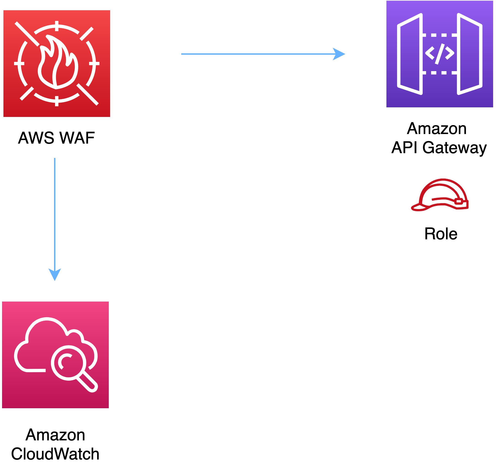

# aws-wafwebacl-apigateway module
<!--BEGIN STABILITY BANNER-->

---


> All classes are under active development and subject to non-backward compatible changes or removal in any
> future version. These are not subject to the [Semantic Versioning](https://semver.org/) model.
> This means that while you may use them, you may need to update your source code when upgrading to a newer version of this package.

---
<!--END STABILITY BANNER-->

| **Reference Documentation**:| <span style="font-weight: normal">https://docs.aws.amazon.com/solutions/latest/constructs/</span>|
|:-------------|:-------------|
<div style="height:8px"></div>


| **Language**     | **Package**        |
|:-------------|-----------------|
| Python|`aws_solutions_constructs.aws_wafwebacl_apigateway`|
| Typescript|`@aws-solutions-constructs/aws-wafwebacl-apigateway`|
| Java|`software.amazon.awsconstructs.services.wafwebaclapigateway`|

## Overview
This AWS Solutions Construct implements an AWS WAF web ACL connected to Amazon API Gateway REST API.

Here is a minimal deployable pattern definition:

Typescript
``` typescript
import { Construct } from 'constructs';
import { Stack, StackProps } from 'aws-cdk-lib';
import * as lambda from "aws-cdk-lib/aws-lambda";
import { ApiGatewayToLambda } from '@aws-solutions-constructs/aws-apigateway-lambda';
import { WafwebaclToApiGatewayProps, WafwebaclToApiGateway } from "@aws-solutions-constructs/aws-wafwebacl-apigateway";

const apiGatewayToLambda = new ApiGatewayToLambda(this, 'ApiGatewayToLambdaPattern', {
  lambdaFunctionProps: {
    runtime: lambda.Runtime.NODEJS_16_X,
    handler: 'index.handler',
    code: lambda.Code.fromAsset(`lambda`)
  }
});

// This construct can only be attached to a configured API Gateway.
new WafwebaclToApiGateway(this, 'test-wafwebacl-apigateway', {
  existingApiGatewayInterface: apiGatewayToLambda.apiGateway
});
```

Python
``` python
from aws_solutions_constructs.aws_apigateway_lambda import ApiGatewayToLambda
from aws_solutions_constructs.aws_wafwebacl_apigateway import WafwebaclToApiGatewayProps, WafwebaclToApiGateway
from aws_cdk import (
    aws_apigateway as api,
    aws_lambda as _lambda,
    Stack
)
from constructs import Construct

api_gateway_to_lambda = ApiGatewayToLambda(self, 'ApiGatewayToLambdaPattern',
                                    lambda_function_props=_lambda.FunctionProps(
                                        code=_lambda.Code.from_asset(
                                            'lambda'),
                                        runtime=_lambda.Runtime.PYTHON_3_9,
                                        handler='index.handler'
                                    )
                                    )

# This construct can only be attached to a configured API Gateway.
WafwebaclToApiGateway(self, 'test_wafwebacl_apigateway',
                    existing_api_gateway_interface=api_gateway_to_lambda.api_gateway
                    )
```

Java
``` java
import software.constructs.Construct;

import software.amazon.awscdk.Stack;
import software.amazon.awscdk.StackProps;
import software.amazon.awscdk.services.apigateway.*;
import software.amazon.awscdk.services.lambda.*;
import software.amazon.awscdk.services.lambda.Runtime;
import software.amazon.awsconstructs.services.apigatewaylambda.*;
import software.amazon.awsconstructs.services.wafwebaclapigateway.*;

final ApiGatewayToLambda apiGatewayToLambda = new ApiGatewayToLambda(this, "ApiGatewayToLambdaPattern",
        new ApiGatewayToLambdaProps.Builder()
                .lambdaFunctionProps(new FunctionProps.Builder()
                        .runtime(Runtime.NODEJS_16_X)
                        .code(Code.fromAsset("lambda"))
                        .handler("index.handler")
                        .build())
                .build());

// This construct can only be attached to a configured Application Load
// Balancer.
new WafwebaclToApiGateway(this, "test-wafwebacl-apigateway", new WafwebaclToApiGatewayProps.Builder()
        .existingApiGatewayInterface(apiGatewayToLambda.getApiGateway())
        .build());
```

## Pattern Construct Props

| **Name**     | **Type**        | **Description** |
|:-------------|:----------------|-----------------|
|existingApiGatewayInterface|[`api.IRestApi`](https://docs.aws.amazon.com/cdk/api/v2/docs/aws-cdk-lib.aws_apigateway.IRestApi.html)|The existing API Gateway instance that will be protected with the WAF web ACL. *Note that a WAF web ACL can only be added to a configured API Gateway, so this construct only accepts an existing IRestApi and does not accept apiGatewayProps.*|
|existingWebaclObj?|[`waf.CfnWebACL`](https://docs.aws.amazon.com/cdk/api/v2/docs/aws-cdk-lib.aws_waf.CfnWebACL.html)|Existing instance of a WAF web ACL, an error will occur if this and props is set.|
|webaclProps?|[`waf.CfnWebACLProps`](https://docs.aws.amazon.com/cdk/api/v2/docs/aws-cdk-lib.aws_waf.CfnWebACLProps.html)|Optional user-provided props to override the default props for the AWS WAF web ACL. To use a different collection of managed rule sets, specify a new rules property. Use our [`wrapManagedRuleSet(managedGroupName: string, vendorName: string, priority: number)`](../core/lib/waf-defaults.ts) function from core to create an array entry from each desired managed rule set.|

## Pattern Properties

| **Name**     | **Type**        | **Description** |
|:-------------|:----------------|-----------------|
|webacl|[`waf.CfnWebACL`](https://docs.aws.amazon.com/cdk/api/v2/docs/aws-cdk-lib.aws_waf.CfnWebACL.html)|Returns an instance of the waf.CfnWebACL created by the construct.|
|apiGateway|[`api.IRestApi`](https://docs.aws.amazon.com/cdk/api/v2/docs/aws-cdk-lib.aws_apigateway.IRestApi.html)|Returns an instance of the API Gateway REST API created by the pattern. |

## Default settings

Out of the box implementation of the Construct without any override will set the following defaults:

### AWS WAF
* Deploy a WAF web ACL with 7 [AWS managed rule groups](https://docs.aws.amazon.com/waf/latest/developerguide/aws-managed-rule-groups-list.html).
    * AWSManagedRulesBotControlRuleSet
    * AWSManagedRulesKnownBadInputsRuleSet
    * AWSManagedRulesCommonRuleSet
    * AWSManagedRulesAnonymousIpList
    * AWSManagedRulesAmazonIpReputationList
    * AWSManagedRulesAdminProtectionRuleSet
    * AWSManagedRulesSQLiRuleSet

    *Note that the default rules can be replaced by specifying the rules property of CfnWebACLProps*
* Send metrics to Amazon CloudWatch

### Amazon API Gateway
* User provided API Gateway object is used as-is

## Architecture


***
&copy; Copyright Amazon.com, Inc. or its affiliates. All Rights Reserved.
