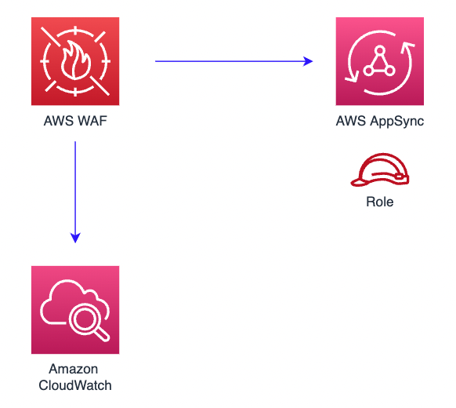

# aws-wafwebacl-appsync module

<!--BEGIN STABILITY BANNER-->

---


> All classes are under active development and subject to non-backward compatible changes or removal in any
> future version. These are not subject to the [Semantic Versioning](https://semver.org/) model.
> This means that while you may use them, you may need to update your source code when upgrading to a newer version of this package.

---

<!--END STABILITY BANNER-->

| **Reference Documentation**: | <span style="font-weight: normal">https://docs.aws.amazon.com/solutions/latest/constructs/</span> |
| :--------------------------- | :------------------------------------------------------------------------------------------------ |

<div style="height:8px"></div>

| **Language**                                                                                   | **Package**                                               |
| :--------------------------------------------------------------------------------------------- | --------------------------------------------------------- |
|  Python             | `aws_solutions_constructs.aws_wafwebacl_appsync`          |
|  Typescript | `@aws-solutions-constructs/aws-wafwebacl-appsync`         |
|  Java                   | `software.amazon.awsconstructs.services.wafwebaclappsync` |

## Overview

This AWS Solutions Construct implements an AWS WAF web ACL connected to an AWS AppSync API.

Here is a minimal deployable pattern definition:

Typescript

```typescript
import { Construct } from "constructs";
import { Stack, StackProps } from "aws-cdk-lib";
import {
  WafwebaclToAppsyncProps,
  WafwebaclToAppsync,
} from "@aws-solutions-constructs/aws-wafwebacl-appsync";

// Use an existing AppSync GraphQL API
const existingGraphQLApi = previouslyCreatedApi;

// This construct can only be attached to a configured AWS AppSync API.
new WafwebaclToAppsync(this, "test-wafwebacl-appsync", {
  existingAppsyncApi: existingGraphQLApi,
});
```

Python

```python
from aws_solutions_constructs.aws_wafwebacl_appsync import WafwebaclToAppsyncProps, WafwebaclToAppsync
from aws_cdk import (
    aws_route53 as route53,
    Stack
)
from constructs import Construct

# Use an existing AppSync API
existingGraphQLApi = previouslyCreatedApi


# This construct can only be attached to a configured AWS AppSync API.
WafwebaclToAppsync(self, 'test_wafwebacl_appsync',
                existing_appsync_api=existingGraphQLApi
                )
```

Java

```java
import software.constructs.Construct;

import software.amazon.awscdk.Stack;
import software.amazon.awscdk.StackProps;
import software.amazon.awsconstructs.services.wafwebaclappsync.*;

// Use an existing AppSync API
final existingGraphQLApi = previouslyCreatedApi


// This construct can only be attached to a configured AWS AppSync API.
new WafwebaclToAppsync(this, "test-wafwebacl-appsync", new WafwebaclToAppsyncProps.Builder()
        .existingAppsyncApi(existingGraphQLApi)
        .build());
```

## Pattern Construct Props

| **Name**           | **Type**                                                                                                          | **Description**                                                                                                                                                                                                                                                                                                                                                                   |
| :----------------- | :---------------------------------------------------------------------------------------------------------------- | --------------------------------------------------------------------------------------------------------------------------------------------------------------------------------------------------------------------------------------------------------------------------------------------------------------------------------------------------------------------------------- |
| existingAppsyncApi | [`appsync.CfnGraphQLApi`](https://docs.aws.amazon.com/cdk/api/v2/docs/aws-cdk-lib.aws_appsync.CfnGraphQLApi.html) | The existing Appsync CfnGraphQLApi object that will be protected with the WAF web ACL. _Note that a WAF web ACL can only be added to a configured AppSync API, so this construct only accepts an existing CfnGraphQLApi and does not accept CfnGraphQLApiProps._                                                                                                                  |
| existingWebaclObj? | [`waf.CfnWebACL`](https://docs.aws.amazon.com/cdk/api/v2/docs/aws-cdk-lib.aws_waf.CfnWebACL.html)                 | Existing instance of a WAF web ACL, an error will occur if this and props is set.                                                                                                                                                                                                                                                                                                 |
| webaclProps?       | [`waf.CfnWebACLProps`](https://docs.aws.amazon.com/cdk/api/v2/docs/aws-cdk-lib.aws_waf.CfnWebACLProps.html)       | Optional user-provided props to override the default props for the AWS WAF web ACL. To use a different collection of managed rule sets, specify a new rules property. Use our [`wrapManagedRuleSet(managedGroupName: string, vendorName: string, priority: number)`](../core/lib/waf-defaults.ts) function from core to create an array entry from each desired managed rule set. |

## Pattern Properties

| **Name**   | **Type**                                                                                                          | **Description**                                                    |
| :--------- | :---------------------------------------------------------------------------------------------------------------- | ------------------------------------------------------------------ |
| webacl     | [`waf.CfnWebACL`](https://docs.aws.amazon.com/cdk/api/v2/docs/aws-cdk-lib.aws_waf.CfnWebACL.html)                 | Returns an instance of the waf.CfnWebACL created by the construct. |
| appsyncApi | [`appsync.CfnGraphQLApi`](https://docs.aws.amazon.com/cdk/api/v2/docs/aws-cdk-lib.aws_appsync.CfnGraphQLApi.html) | Returns an instance of the CfnGraphQLApi used by the pattern.      |

## Default settings

Out of the box implementation of the Construct without any override will set the following defaults:

### AWS WAF

- Deploy a WAF web ACL with 7 [AWS managed rule groups](https://docs.aws.amazon.com/waf/latest/developerguide/aws-managed-rule-groups-list.html).

  - AWSManagedRulesBotControlRuleSet
  - AWSManagedRulesKnownBadInputsRuleSet
  - AWSManagedRulesCommonRuleSet
  - AWSManagedRulesAnonymousIpList
  - AWSManagedRulesAmazonIpReputationList
  - AWSManagedRulesAdminProtectionRuleSet
  - AWSManagedRulesSQLiRuleSet

  _Note that the default rules can be replaced by specifying the rules property of CfnWebACLProps_

- Send metrics to Amazon CloudWatch

### AppSync API

- User provided AppSync graphql API object is used as-is

## Architecture



---

&copy; Copyright 2022 Amazon.com, Inc. or its affiliates. All Rights Reserved.
