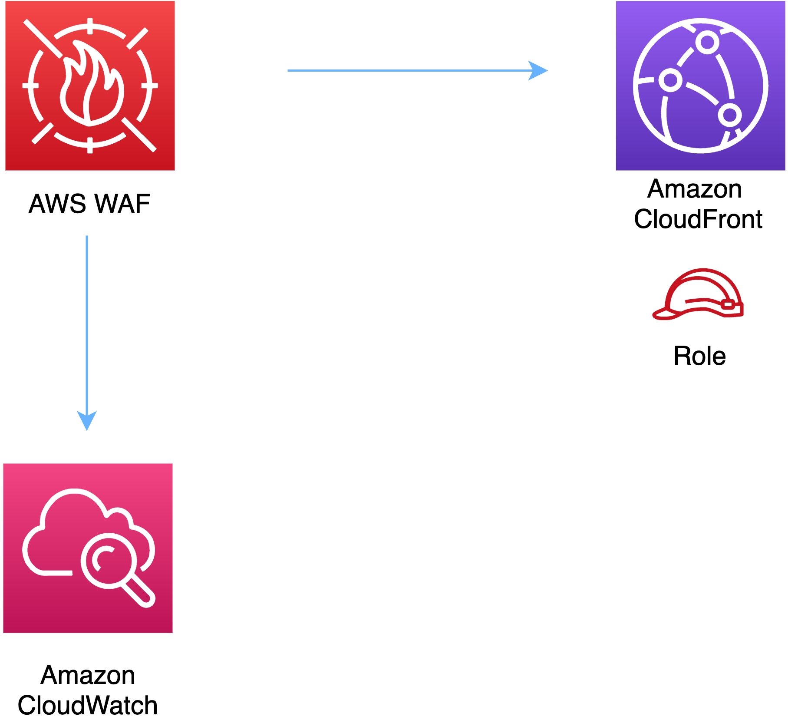

# aws-wafwebacl-cloudfront module
<!--BEGIN STABILITY BANNER-->

---


> All classes are under active development and subject to non-backward compatible changes or removal in any
> future version. These are not subject to the [Semantic Versioning](https://semver.org/) model.
> This means that while you may use them, you may need to update your source code when upgrading to a newer version of this package.

---
<!--END STABILITY BANNER-->

| **Reference Documentation**:| <span style="font-weight: normal">https://docs.aws.amazon.com/solutions/latest/constructs/</span>|
|:-------------|:-------------|
<div style="height:8px"></div>


| **Language**     | **Package**        |
|:-------------|-----------------|
| Python|`aws_solutions_constructs.aws_wafwebacl_cloudfront`|
| Typescript|`@aws-solutions-constructs/aws-wafwebacl-cloudfront`|
| Java|`software.amazon.awsconstructs.services.wafwebaclcloudfront`|

## Overview
This AWS Solutions Construct implements an AWS WAF web ACL connected to Amazon CloudFront.

Here is a minimal deployable pattern definition:

Typescript
``` typescript
import { Construct } from 'constructs';
import { Stack, StackProps } from 'aws-cdk-lib';
import { CloudFrontToS3 } from '@aws-solutions-constructs/aws-cloudfront-s3';
import { WafwebaclToCloudFront } from "@aws-solutions-constructs/aws-wafwebacl-cloudfront";

const cloudfrontToS3 = new CloudFrontToS3(this, 'test-cloudfront-s3', {});

// This construct can only be attached to a configured CloudFront.
new WafwebaclToCloudFront(this, 'test-wafwebacl-cloudfront', {
    existingCloudFrontWebDistribution: cloudfrontToS3.cloudFrontWebDistribution
});
```

Python
```python
from aws_solutions_constructs.aws_cloudfront_s3 import CloudFrontToS3
from aws_solutions_constructs.aws_wafwebacl_cloudfront import WafwebaclToCloudFront
from aws_cdk import Stack
from constructs import Construct

cloudfront_to_s3 = CloudFrontToS3(self, 'test_cloudfront_s3')

# This construct can only be attached to a configured CloudFront.
WafwebaclToCloudFront(self, 'test_wafwebacl_cloudfront',
                      existing_cloud_front_web_distribution=cloudfront_to_s3.cloud_front_web_distribution
                      )
```

Java
``` java
import software.constructs.Construct;

import software.amazon.awscdk.Stack;
import software.amazon.awscdk.StackProps;
import software.amazon.awsconstructs.services.cloudfronts3.*;
import software.amazon.awsconstructs.services.wafwebaclcloudfront.*;

final CloudFrontToS3 cloudfrontToS3 = new CloudFrontToS3(this, "test-cloudfront-s3",
        new CloudFrontToS3Props.Builder()
                .build());

// This construct can only be attached to a configured CloudFront.
new WafwebaclToCloudFront(this, "test-wafwebacl-cloudfront", new WafwebaclToCloudFrontProps.Builder()
        .existingCloudFrontWebDistribution(cloudfrontToS3.getCloudFrontWebDistribution())
        .build());
```

## Pattern Construct Props

| **Name**     | **Type**        | **Description** |
|:-------------|:----------------|-----------------|
|existingCloudFrontWebDistribution|[`cloudfront.Distribution`](https://docs.aws.amazon.com/cdk/api/latest/docs/@aws-cdk_aws-cloudfront.Distribution.html)|The existing CloudFront instance that will be protected with the WAF web ACL. *Note that a WAF web ACL can only be added to a configured CloudFront, so this construct only accepts an existing Distribution and does not accept cloudfrontProps.*|
|existingWebaclObj?|[`waf.CfnWebACL`](https://docs.aws.amazon.com/cdk/api/latest/docs/@aws-cdk_aws-wafv2.CfnWebACL.html)|Existing instance of a WAF web ACL, an error will occur if this and props is set.|
|webaclProps?|[`waf.CfnWebACLProps`](https://docs.aws.amazon.com/cdk/api/latest/docs/@aws-cdk_aws-wafv2.CfnWebACLProps.html)|Optional user-provided props to override the default props for the AWS WAF web ACL. To use a different collection of managed rule sets, specify a new rules property. Use our [`wrapManagedRuleSet(managedGroupName: string, vendorName: string, priority: number)`](../core/lib/waf-defaults.ts) function from core to create an array entry from each desired managed rule set.|

## Pattern Properties

| **Name**     | **Type**        | **Description** |
|:-------------|:----------------|-----------------|
|webacl|[`waf.CfnWebACL`](https://docs.aws.amazon.com/cdk/api/latest/docs/@aws-cdk_aws-wafv2.CfnWebACL.html)|Returns an instance of the waf.CfnWebACL created by the construct.|
|cloudFrontWebDistribution|[`cloudfront.Distribution`](https://docs.aws.amazon.com/cdk/api/latest/docs/@aws-cdk_aws-cloudfront.Distribution.html)|Returns an instance of cloudfront.Distribution created by the construct.|

## Default settings

Out of the box implementation of the Construct without any override will set the following defaults:

### AWS WAF
* Deploy a WAF web ACL with 7 [AWS managed rule groups](https://docs.aws.amazon.com/waf/latest/developerguide/aws-managed-rule-groups-list.html).
    * AWSManagedRulesBotControlRuleSet
    * AWSManagedRulesKnownBadInputsRuleSet
    * AWSManagedRulesCommonRuleSet
    * AWSManagedRulesAnonymousIpList
    * AWSManagedRulesAmazonIpReputationList
    * AWSManagedRulesAdminProtectionRuleSet
    * AWSManagedRulesSQLiRuleSet

    *Note that the default rules can be replaced by specifying the rules property of CfnWebACLProps*
* Send metrics to Amazon CloudWatch

### Amazon CloudFront
* User provided CloudFront object is used as-is

## Architecture


***
&copy; Copyright 2022 Amazon.com, Inc. or its affiliates. All Rights Reserved.
