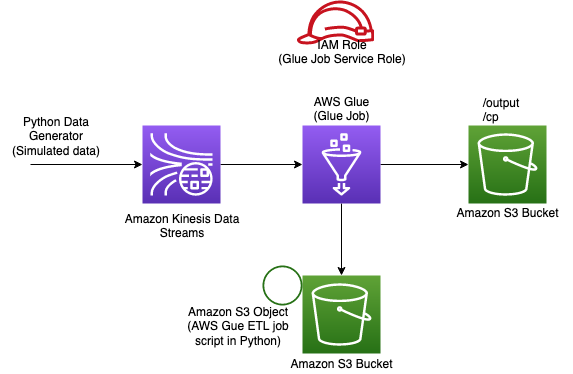
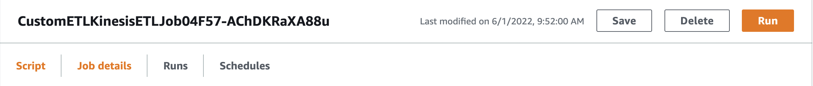
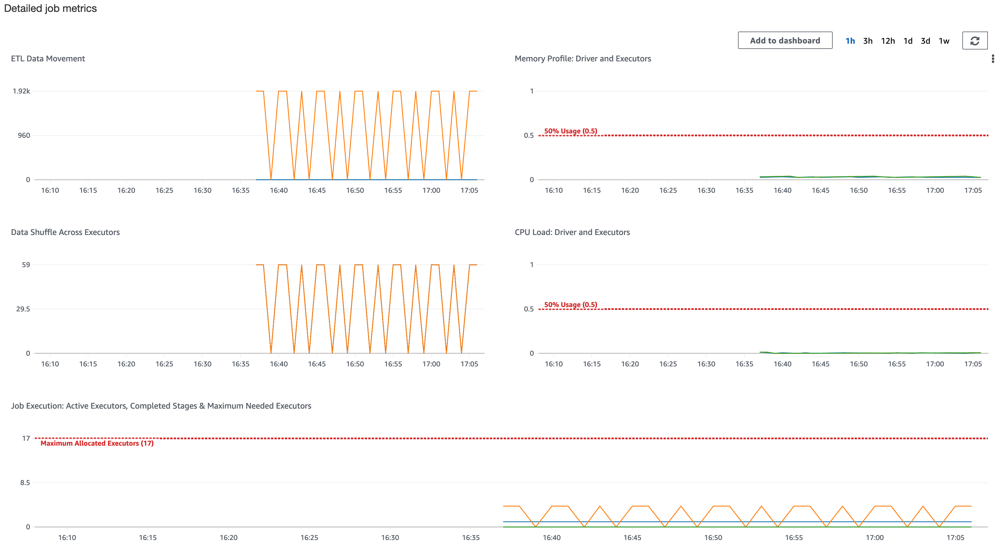

# AWS Glue Custom ETL Job

This use case implements an example using the Kinesis Data Streams Glue Job construct.

This use case is designed to be built and deployed into your account from your local environment using the AWS CDK Toolkit (or CLI). For information on the toolkit and how to install and configure it, please see the [guide](https://docs.aws.amazon.com/cdk/latest/guide/cli.html).

## Architecture

The application architecture uses a custom ETL job defined in AWS Glue that takes in data from Amazon Kinesis Data Streams to
process and store it in the target datastore as defined by the ETL script (for this example an S3 bucket location).



## Deployment steps

Below are the steps to deploy the use case:

```
# Set the proper version numbers in the package.json file
../../../deployment/v2/align-version.sh

# Install dependencies
npm install

# Build the use case
npm run build

# Deploy the use case
cdk deploy
```

Post deployment, this example will publish the name of the Kinesis Data Stream in the CloudFormation output. Use that name to produce sample data into this data stream using the generator code in the `stream-producer` folder.

```
# Change into `stream-producer` directory.
cd stream-producer

# Install the projects base dependencies.
pip install -r requirements.txt
```

In the `generate_data.py` file, please update the AWS credential portion of the code and then run the following command from the CLI
```
python3 generate_data.py --region <region-name> --streamname <name-of-the-stream-obtained-from-the-cloudformation-output>
```

This will generate data into the Kinesis Data Stream. For this example the AWS Glue Job has to be manually triggered and stopped (either from the CLI or
the AWS management console). This is to make sure that you control the time for which you want to run the job and its corresponding cost.

Command Line Interface
```
aws glue start-job-run --job-name <name-of-the-job-obtained-from-the-cloudformation-output>
```

AWS Management Console
1. Go on AWS Glue
2. Click `Jobs` under ETL on the left-side panel
3. Click on the name of the created job
4. Click `Run` on the upper-right corner to start the Glue Job


Once triggered the ETL transform in AWS Glue writes the data into an S3 bucket (ARN is published in CloudFormation stack resources) and publishes logs in Amazon CloudWatch. You can also view the job metrics like below in AWS Glue Studio.



&copy; Copyright 2022 Amazon.com, Inc. or its affiliates. All Rights Reserved.
