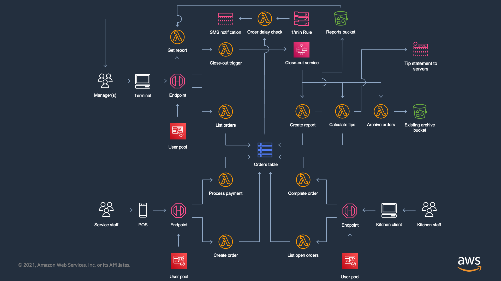

# AWS Solutions Constructs - Restaurant Management System Example

This use case is designed to be built and deployed into your account from your local environment using the AWS CDK Toolkit (or CLI). For information on the toolkit and how to install and configure it, please see the [guide](https://docs.aws.amazon.com/cdk/latest/guide/cli.html).

> **IMPORTANT:** To ensure proper functionality, the AWS Solutions Constructs packages and AWS CDK packages in your project must be the same version. If you are experiencing odd behavior, check in your `package.json` file that all references to CDK modules and AWS Solutions Constructs modules have the same version number, and that none include the preceding caret `^`. Once the versions are aligned, delete `package-lock.json` and the `node_modules` folder and run `npm install` to sync the modules.

## Overview

This example demonstrates how to build a complex, real-world system using AWS Solutions Constructs. It is designed to 
accompany the webinar titled "Beyond Prototypes: Real-World Applications with AWS Solutions Constructs", which 
can be found [here](#) (coming soon!). On its own, this use case will provision a demo restaurant management system for three user types 
with the various capabilities:

#### Service staff
- Create a new order
- Close-out an order

#### Kitchen staff
- View all open orders
- Complete/fulfill an order

#### Managers
- View all orders (all statuses)
- Close-out service
  - Generate sales report
  - Calculate tips for servers
  - Archive orders to the data warehouse (and clear out the table)
- Automatic delayed order detection
- View a specific sales report

## CDK project structure
This CDK project will deploy a total of five (5) stacks into your AWS account using CloudFormation:
- `ExistingResources` - provisions an Amazon S3 bucket into your account that simulates/demonstrates using the project with existing infrastructure.
- `SharedStack` - provisions resources that are used across the following three stacks, including a central DynamoDB table (with configuration) and a Lambda layer for common database access functions (i.e. using a table scan to get all orders, archive the table, etc.).
- `ServiceStaffStack` - provisions resources that are used by service staff to access the system. Provides functions that allow users to create a new order and close out an order.
- `KitchenStaffStack` - provisions resources that are used by kitchen staff to access the system. Provides functions that allow users to view all open orders and mark a specific order as filled by the kitchen.
- `ManagerStack` - provisions resources that are used by one or more managers to access the system. Provides functions that allow users to view all orders (regardless of status), close-out the service for a day, and retrieve a specific report saved from a previous day's close-out.

## Setting up
After cloning this project into your local environment, we recommend performing the following steps to deploy it into 
your account:
- Run `../../../deployment/align-version.sh` from the root level of the use case, to set the proper version numbers in the package.json file.
- Run `npm install` to install all dependencies.
- Run `npm run build` to build the project.
- Run `cdk deploy --all` to initiate the deployment.

Note: If you are working on a clean instance or development environment, you will need to perform initial configuration
steps for the CDK in order to deploy the project. Click [here](https://docs.aws.amazon.com/cdk/latest/guide/getting_started.html) for 
more information on getting started with the CDK.

## Business logic
This demo features multiple Lambda functions, one assigned to each function for each user role. The business logic that
each of these functions runs can be found organized under the `lib/lambda` folder. Each function is decoupled and managed
within its own folder.

## API
This demo implements three REST APIs using AWS Gateway, one for each user type. For sample requests of each type, please
refer to the `SAMPLE_REQUESTS.md` file. Mappings are provided as follows:

### Service staff
- `/create-order` - POST- creates a new order with status set to 'OPEN'. Request parameters:
  - `createdBy` - the username of the server who created the order.
  - `tableNumber` - the table number for the order to be delivered to.
  - `items` - an array of items that comprise the order.
  - `orderTotal` - the order total in USD, not including tip.
  - `timeOpened` - the date/time in UTC milliseconds that the order was created.
  - `tipAmount` - the amount tipped to the server.
- `/process-payment` - POST - closes out the order and sets the status to 'CLOSED'. Request parameters:
  - `orderId` - the unique order id.

### Kitchen staff
- `/get-open-orders` - GET - lists all orders that have a status of 'OPEN'.
- `/complete-order` - POST - updates the status of an order to 'FILLED'. Request parameters:
  - `orderId` - the unique order id.

### Managers
- `/get-all-orders` - GET - lists all orders, regardless of status.
- `/close-out-service` - ANY - triggers the close-out process, invoking a Step Functions workflow that generates a 
  sales report, calculates tips for all servers, and archives orders from DynamoDB to Redshift.
- `/get-report` - POST - get a specific sales report from the static assets bucket.  
  - `filename` - the filename of the report.

## Using the API
This demo provisions an architecture that is ready to be hooked up to a front-end application of your choice/design. 
Since the three API endpoints provisioned by this architecture are secured by Cognito, it is recommended to review the
steps listed [here](https://docs.aws.amazon.com/apigateway/latest/developerguide/apigateway-invoke-api-integrated-with-cognito-user-pool.html) 
to call a REST API that has been integrated with a Cognito user pool.

You can also find more information on how to integrate these APIs with an application powered by AWS Amplify using 
multiple languages [here](https://docs.aws.amazon.com/cognito/latest/developerguide/cognito-integrate-apps.html).

## Testing the API
Testing the API and working directly with the database for development purposes can be done using the API Gateway
Management Console. Although each API is deployed with a unique resource name, they can be distinguished using the 
descriptions that are auto-provided by this use case. Simply open the API of your choice, select Resources from the left-hand sidebar,
open the ANY method of the resource of your choice, and click the TEST button in the Client box. Here, you can provide 
structured requests using API model above to interact with the system.

## Database
This demo will implement a main database from which all functions read/write to/from. This database will be used for 
managing orders for a specific service. When the restaurant opens, the database should be empty. Throughout the service 
period, the database will become populated with both open and closed orders. At the end of service, orders will be closed
out and archived to the data warehouse.

 - `id` - a unique identifier for the order.
 - `createdBy` - the username of the server who created the order.
 - `tableNumber` - the table number for the order to be delivered to.
 - `items` - an array of items that comprise the order.
 - `orderStatus` - the status of the order, can be either 'OPEN', 'FILLED', or 'CLOSED'
 - `orderTotal` - the order total in USD.  
 - `tipAmount` - the amount tipped to the server.
 - `timeOpened` - the date/time in UTC milliseconds that the order was created.
 - `timeClosed` - the date/time in UTC milliseconds that the order was closed.
 - `gsi1pk` - global secondary index partition key.
 - `gsi1sk` - global secondary index sort key.

## Useful commands
The `cdk.json` file tells the CDK Toolkit how to execute your app.

 * `npm run build`   compile typescript to js
 * `npm run watch`   watch for changes and compile
 * `npm run test`    perform the jest unit tests
 * `cdk deploy`      deploy this stack to your default AWS account/region
 * `cdk diff`        compare deployed stack with current state
 * `cdk synth`       emits the synthesized CloudFormation template

## Architecture

***
&copy; Copyright 2021 Amazon.com, Inc. or its affiliates. All Rights Reserved.