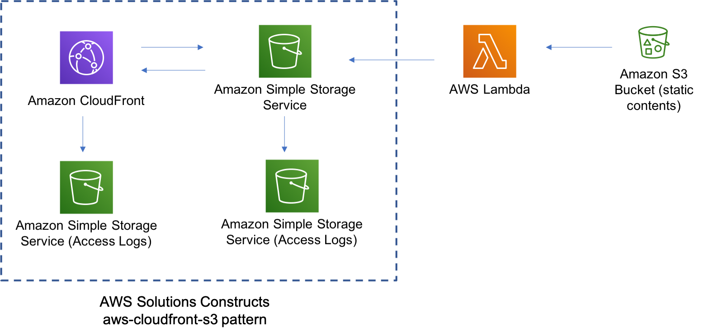

# AWS S3 Static Website Use Case

This use case implements a static website that delivers HTML, JavaScript, images, video and other files to your website visitors and contain no application code. 

This use case is designed to be built and deployed into your account from your local environment using the AWS CDK Toolkit (or CLI). For information on the toolkit and how to install and configure it, please see the [guide](https://docs.aws.amazon.com/cdk/latest/guide/cli.html).

> **IMPORTANT:** To ensure proper functionality, the AWS Solutions Constructs packages and AWS CDK packages in your project must be the same version. If you are experiencing odd behavior, check in your `package.json` file that all references to CDK modules and AWS Solutions Constructs modules have the same version number, and that none include the preceding caret `^`. Once the versions are aligned, delete `package-lock.json` and the `node_modules` folder and run `npm install` to sync the modules.

## Architecture
The application architecture uses an Amazon CloudFront distribution, Amazon S3 and AWS lambda based custom resource to copy the static website content for Wild Rydes demo website.


## Deployment steps
Below are the steps to deploy the use case:

```
# Set the proper version numbers in the package.json file
../../../deployment/align-version.sh

# Install dependencies
npm install

# Build the use case
npm run build

# Deploy the use case
cdk deploy

```

## Deployment Verification
After the stack is deployed successfully, go to the Outputs tab in AWS Cloudformation console, it should show the 'websiteURL', click on the link and enjoy the Wile Rydes Unicorn website.

***
&copy; Copyright 2022 Amazon.com, Inc. or its affiliates. All Rights Reserved.