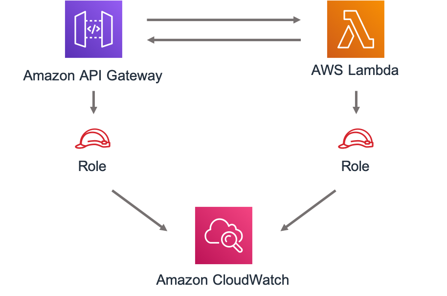

# AWS Serverless Image Handler

This use case construct implements an Amazon CloudFront distribution, an Amazon API Gateway REST API, an AWS Lambda
function, and necessary permissions/logic to provision a functional image handler API for serving image content from 
one or more Amazon S3 buckets within the deployment account.

This use case is designed to serve as a reference for creating and using custom use case constructs. This 
construct can be imported and used in a CDK project alongside other AWS Solutions Constructs and AWS CDK constructs. 
You'll need to create a CDK project in your local development environment first in order to import and use this construct.
For information on setting up a CDK project, please see the [guide](https://docs.aws.amazon.com/cdk/latest/guide/hello_world.html) here.
Once your project is ready, you will need the AWS CDK Toolkit (or CLI) to build and deploy it from your local environment. For information on the toolkit and how to install and configure it, please see the [guide](https://docs.aws.amazon.com/cdk/latest/guide/cli.html) here.

> **IMPORTANT:** To ensure proper functionality, the AWS Solutions Constructs packages and AWS CDK packages in your project must be the same version. If you are experiencing odd behavior, check in your package.json file that all references to CDK modules and AWS Solutions Constructs modules have the same version number, and that none include the preceding caret `^`. Once the versions are aligned, delete `package-lock.json` and the `node_modules` folder and run `npm install` to sync the modules.

Here is a minimal deployable pattern definition in Typescript:

```javascript
const { ServerlessImageHandler } from '@aws-solutions-constructs/aws-serverless-image-handler';

new ServerlessImageHandler(this, 'ServerlessImageHandlerPattern', {
    lambdaFunctionProps: {
        runtime: lambda.Runtime.NODEJS_12_X,
        handler: 'index.handler',
        code: lambda.Code.fromAsset(`${__dirname}/lambda`)
    }
});

```

## Properties

| **Name**     | **Type**        | **Description** |
|:-------------|:----------------|-----------------|
|existingLambdaObj?|[`lambda.Function`](https://docs.aws.amazon.com/cdk/api/latest/docs/@aws-cdk_aws-lambda.Function.html)|Existing instance of Lambda Function object, providing both this and lambdaFunctionProps will cause an error.|
|lambdaFunctionProps?|[`lambda.FunctionProps`](https://docs.aws.amazon.com/cdk/api/latest/docs/@aws-cdk_aws-lambda.FunctionProps.html)|User provided props to override the default props for the Lambda function.|
|apiGatewayProps?|`api.LambdaRestApiProps`|Optional user-provided props to override the default props for the API.|

## Architecture


***
&copy; Copyright 2021 Amazon.com, Inc. or its affiliates. All Rights Reserved.