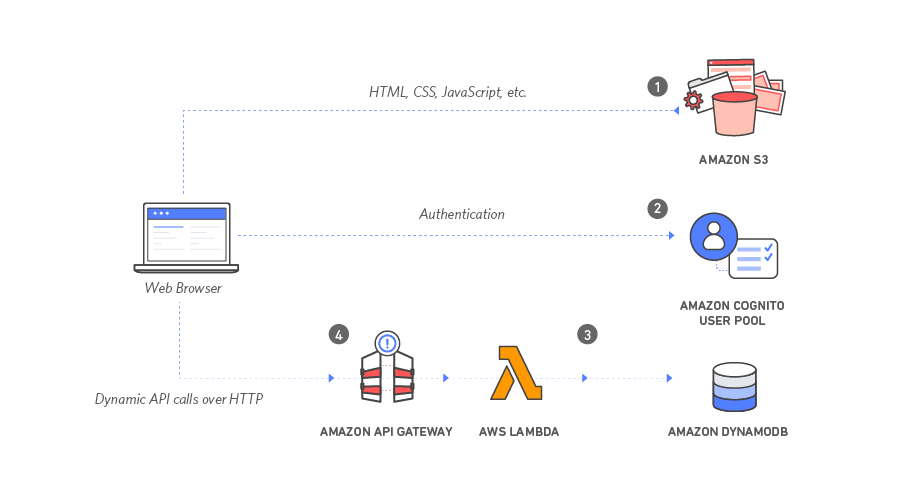

# AWS Serverless Web App Use Case

This use case implements a simple serverless web application that enables users to request unicorn rides from the Wild Rydes fleet. The application will present users with an HTML based user interface for indicating the location where they would like to be picked up and will interface on the backend with a RESTful web service to submit the request and dispatch a nearby unicorn. The application will also provide facilities for users to register with the service and log in before requesting rides.

This use case is designed to be built and deployed into your account from your local environment using the AWS CDK Toolkit (or CLI). For information on the toolkit and how to install and configure it, please see the [guide](https://docs.aws.amazon.com/cdk/latest/guide/cli.html).

> **IMPORTANT:** To ensure proper functionality, the AWS Solutions Constructs packages and AWS CDK packages in your project must be the same version. If you are experiencing odd behavior, check in your `package.json` file that all references to CDK modules and AWS Solutions Constructs modules have the same version number, and that none include the preceding caret `^`. Once the versions are aligned, delete `package-lock.json` and the `node_modules` folder and run `npm install` to sync the modules.

## Architecture
The application architecture uses AWS Lambda, Amazon API Gateway, Amazon S3, Amazon DynamoDB, and Amazon Cognito as pictured below:


## Deployment steps
Below are the steps to deploy the use case:

```
# Set the proper version numbers in the package.json file
../../../deployment/align-version.sh

# Build the use case
npm run build

# Deploy the use case
cdk deploy

```

## Deployment Verification
After the stack is deployed successfully, go to the Outputs tab in AWS Cloudformation console of S3StaticWebsiteStack, it should show the 'websiteURL', click on the link and follow the steps below:

* Visit /register.html under your website domain, register youself.

* Verify the registered user email.

* Visit /ride.html under your website domain.

*  If you are redirected to the sign in page, sign in with the user you created in the previous module.

* After the map has loaded, click anywhere on the map to set a pickup location.

* Choose Request Unicorn. You should see a notification in the right sidebar that a unicorn is on its way and then see a unicorn icon fly to your pickup location.


***
&copy; Copyright 2021 Amazon.com, Inc. or its affiliates. All Rights Reserved.